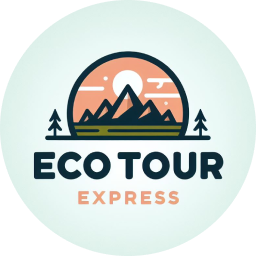

 
<h1>
    Eco Tour Express
</h1>

Proyecto formativo de la tecnología Análisis y Desarrollo de Software. 
 
Este repositorio contiene la vista Front-End del proyecto formativo, el cual se encarga de mostrar visualmente a todos los usuarios las diferentes funcionalidades que tiene el software. 

## 🛠️ Tecnologías

- [**React**](https://es.react.dev/) - biblioteca para interfaces de usuario web y nativas.
- [**React Router**](https://reactrouter.com/en/main) - Framework de JavaScript que gestiona el enrutamiento.

## 🚀 Alojamiento

La vista Front-End del software se encuentra alojada
[**Aquí**](https://ecotourexpress.vercel.app/).
(Al estar en etapa de desarrollo puede sufrir cambios)
